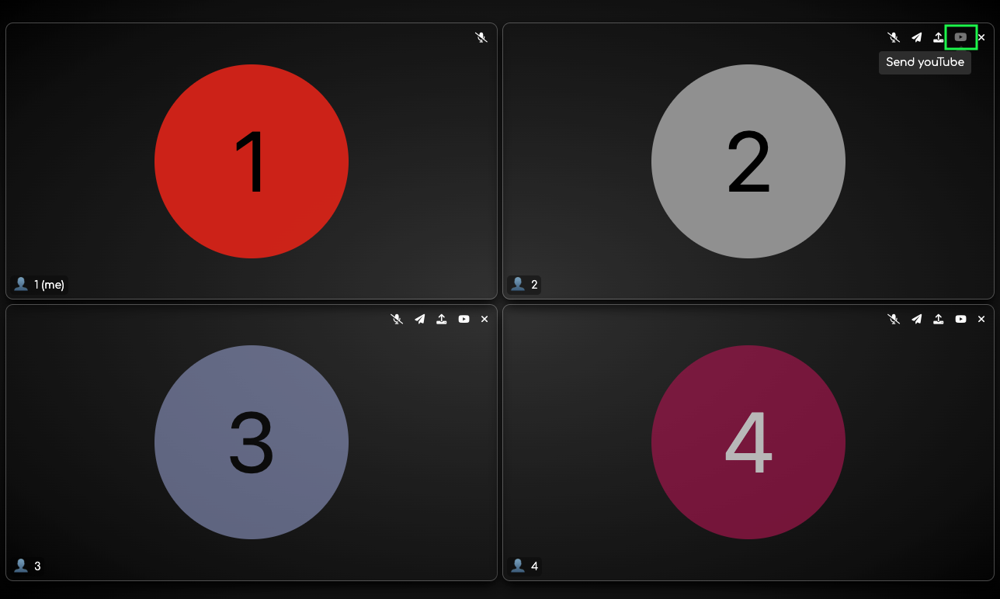
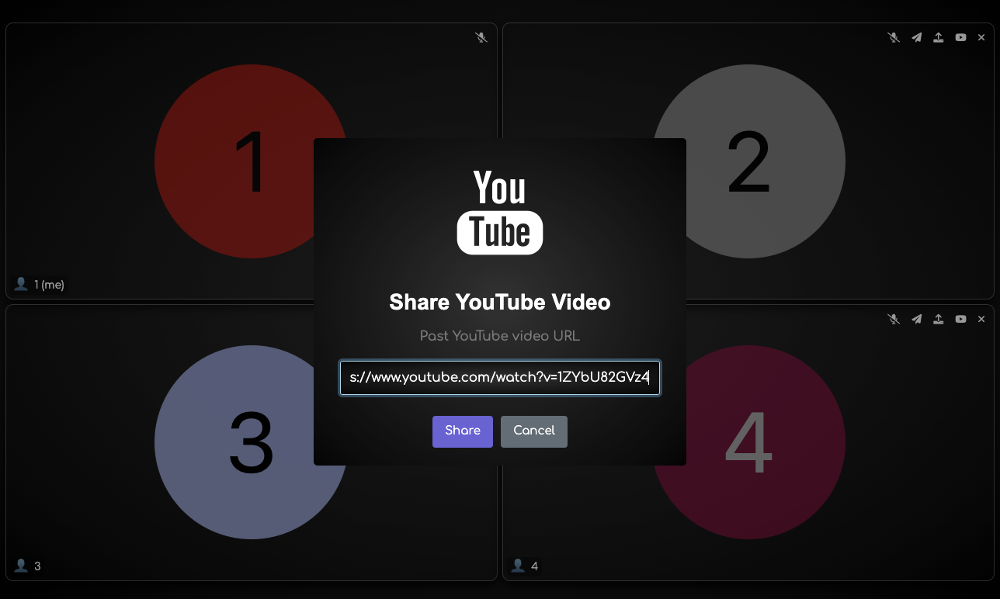
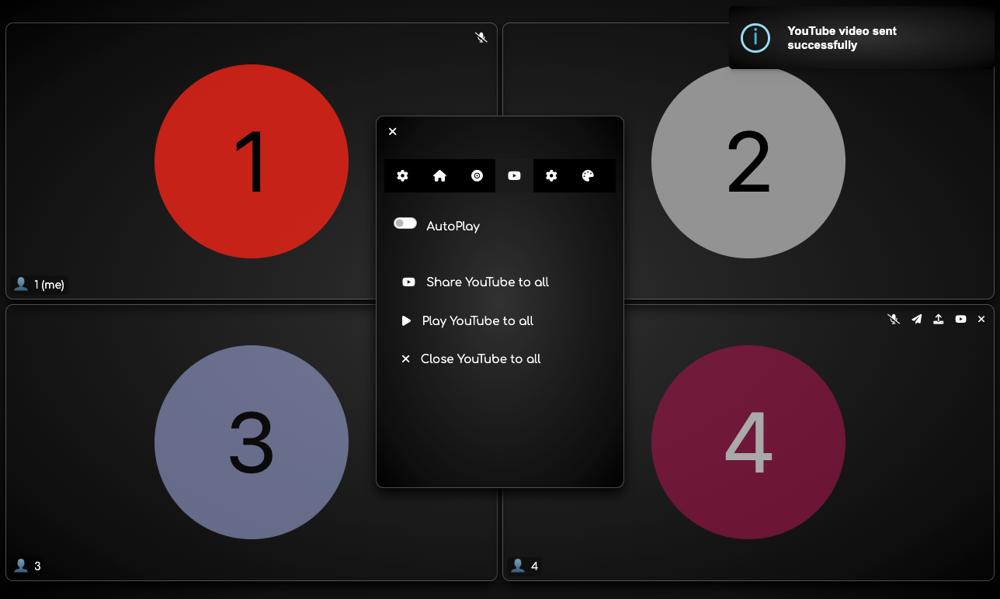
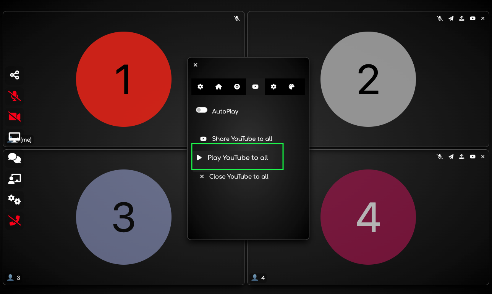
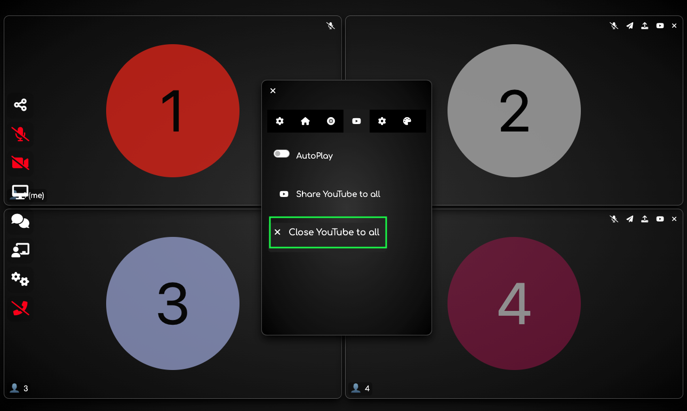
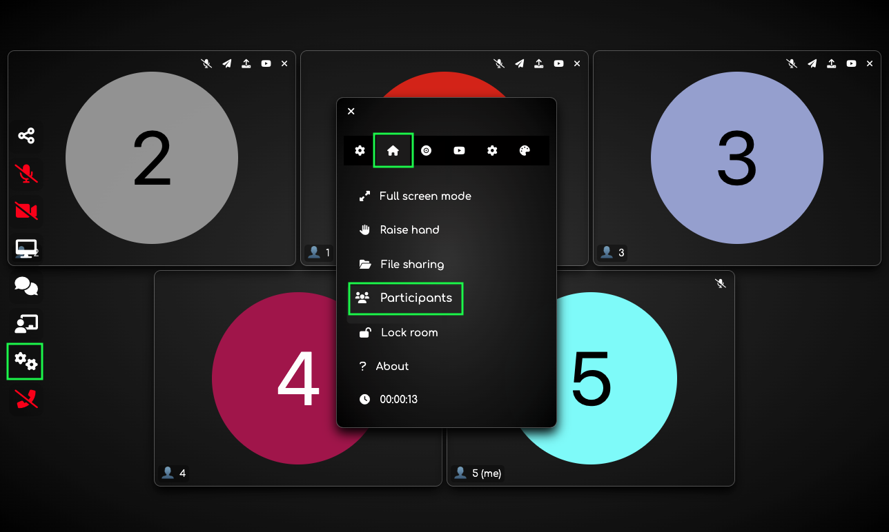
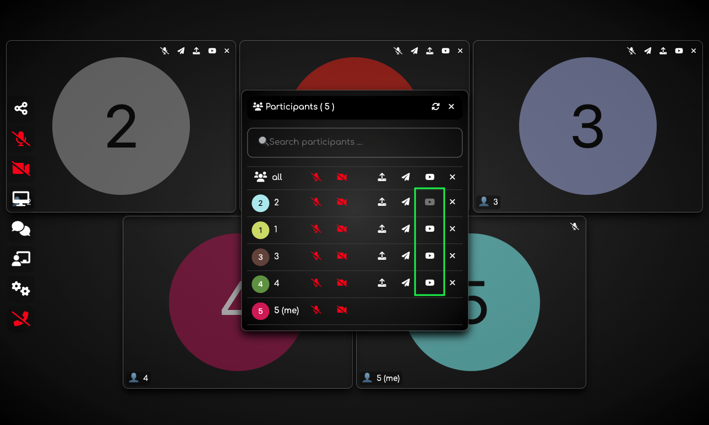
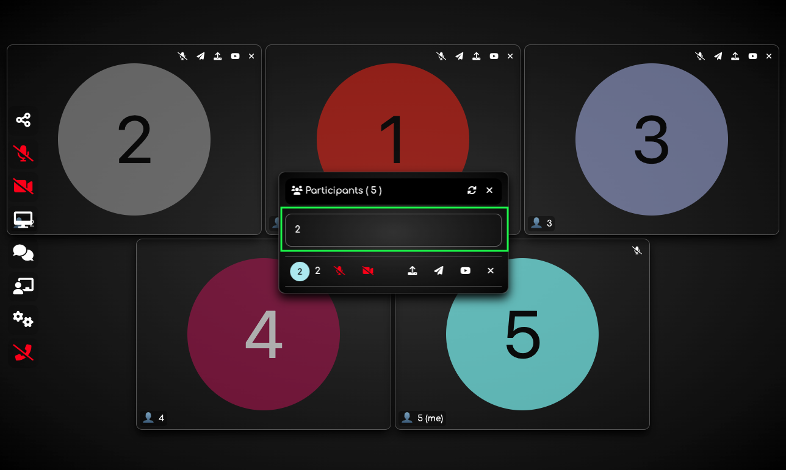

## How it works

Click on YouTube icon.

Share a desidered YouTube video to the participant.

Popup message that the video are sent successfully.

Start to play all the YouTube video sent at the same time.

Close all the YouTube video sent at the same time.

---

 

Another method to share the YouTube videos. Go to settings and then click on participants.

Share a desidered video to selected participant.

You can also filter the participant by name.

---
