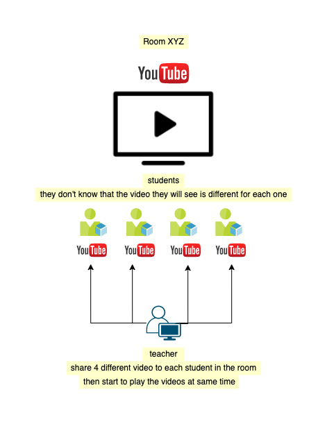

## Change Logs

data: `14.05.2022`

The goal is that the teacher share different videos to all students in the room, then start to play it at the same time.

    

---

-   Customizations:

    -   Share YouTube video streaming with autoplay disabled on default.
    -   Send YouTube video to the chosen participant in the room, disabled the option to close it by the participant.
    -   Added new functionality to play-stop all YouTube video at the same time to all participants in the room.
    -   Removed umami and survey page when some leave the room (not needed for your case of usage).

---

-   Extra:

    -   Added possibility to join room without webcam - audio or both.
    -   Improved the functionality share Room.
    -   Update dependencies to latest version.

---
